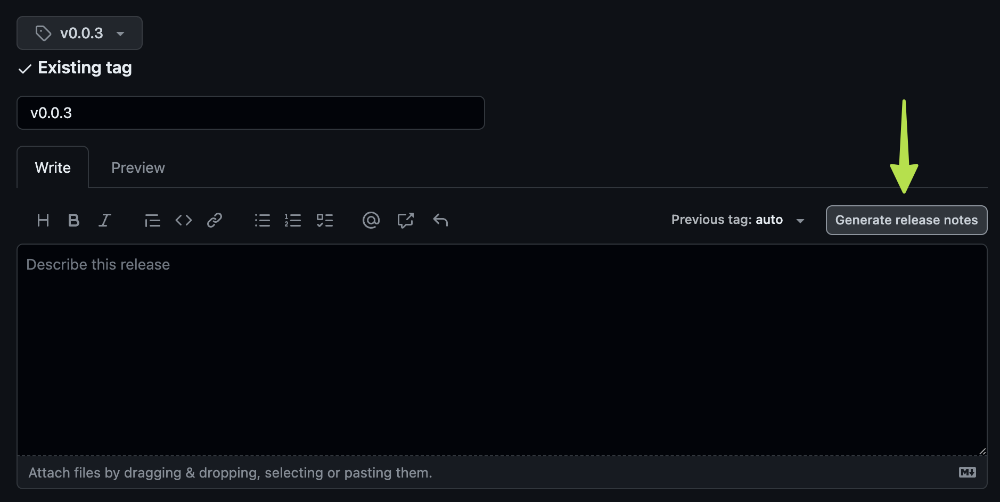
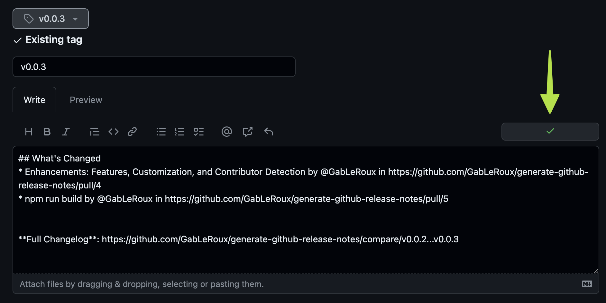

# Generate GitHub Release Notes Action

[](https://github.com/GabLeRoux/generate-github-release-notes/actions/workflows/main.yml)
[](https://codecov.io/gh/GabLeRoux/generate-github-release-notes)

This GitHub Action generates structured release notes by fetching and formatting merged pull requests between specified
tags. It mirrors the functionality of GitHub's "Generate Release Notes" feature available on the release creation page.

## ⚠ Important note

_This project was a personal challenge to practice GitHub Actions development._

**Instead of using this action, you should
use [softprops/action-gh-release@v1](https://github.com/softprops/action-gh-release) which is more mature and already
has a release notes feature.**

> | Name                       | Type    | Description                                                                                                                                                                                                                                                                                                                                                                                                                                     |
> | -------------------------- | ------- | ----------------------------------------------------------------------------------------------------------------------------------------------------------------------------------------------------------------------------------------------------------------------------------------------------------------------------------------------------------------------------------------------------------------------------------------------- |
> | `generate_release_notes`   | Boolean | Whether to automatically generate the name and body for this release. If name is specified, the specified name will be used; otherwise, a name will be automatically generated. If body is specified, the body will be pre-pended to the automatically generated notes. See the [GitHub docs for this feature](https://docs.github.com/en/repositories/releasing-projects-on-github/automatically-generated-release-notes) for more information |

Complete example usage of the suggested alternative:

```yaml
name: Create Release

on:
  push:
    tags:
      - 'v*'

jobs:
  prepareArtifact:
    name: Prepare Artifact
    runs-on: ubuntu-latest
    steps:
      - name: Checkout code
        uses: actions/checkout@v4
      - name: Create Dummy File
        run: |
          mkdir -p build/StandaloneWindows64
          echo "Dummy content" > build/StandaloneWindows64/build-StandaloneWindows64
      - name: Upload Artifact
        uses: actions/upload-artifact@v4
        with:
          name: build-StandaloneWindows64
          path: build/StandaloneWindows64/build-StandaloneWindows64

  release:
    name: Create and Publish Release
    needs: prepareArtifact
    runs-on: ubuntu-latest
    steps:
      - name: Checkout code
        uses: actions/checkout@v4

      - name: Download Artifact
        uses: actions/download-artifact@v4
        with:
          name: build-StandaloneWindows64
          path: build/StandaloneWindows64

      - name: Publish Release and Upload Artifact
        uses: softprops/action-gh-release@v2
        with:
          files: build/StandaloneWindows64/build-StandaloneWindows64
          # this configuration here should give you the same result as the generate-github-release-notes action
          generate_release_notes: true
        env:
          GITHUB_TOKEN: ${{ secrets.GITHUB_TOKEN }}
```

## The "Generate Release Notes" button

Before clicking the "Generate Release Notes" button, the release notes section is empty:



After clicking the "Generate Release Notes" button, the release notes section is populated with the generated release
notes:



Nice! Now, let's see how to do the same thing with GitHub Actions.

## Features

- **Automated Release Notes Generation:** Creates release notes based on merged PRs between tags.
- **New Contributors Detection:** Optionally identifies first-time contributors to your project.
- **Customizable Tag Comparison:** Specify base and head tags for comparison.
- **GitHub Token Support:** Utilizes GitHub token for repository access.

## Configuration

To use this action in your workflow, add the following step:

```yaml
- name: Generate Release Notes
  uses: gableroux/generate-github-release-notes@v0.1
  with:
    repository: ${{ github.repository }}
    base_tag: ${{ github.event.release.tag_name }}
    head_tag: ${{ github.sha }}
    github_token: ${{ secrets.GITHUB_TOKEN }}
    # auto_detect_new_contributors: 'true' # Optional, set to 'true' to detect new contributors, this is still experimental.
```

## Usage

1. **Include the Action:** Incorporate the action in your GitHub workflow.
2. **Set Tags:** Define `base_tag` and `head_tag` to specify the tag range.
3. **GitHub Token:** Provide a GitHub token for repository access. This is provided by default by github actions.
4. **Run the Workflow:** Trigger the workflow to generate release notes.

## Output example

```markdown
## What's Changed

* Enhancements: Features, Customization, and Contributor Detection by @GabLeRoux
  in https://github.com/GabLeRoux/generate-github-release-notes/pull/4
* npm run build by @GabLeRoux in https://github.com/GabLeRoux/generate-github-release-notes/pull/5

**Full Changelog**: https://github.com/GabLeRoux/generate-github-release-notes/compare/v0.0.2...v0.0.3
```

### Rendered output example

---

## What's Changed

* Enhancements: Features, Customization, and Contributor Detection by @GabLeRoux
  in https://github.com/GabLeRoux/generate-github-release-notes/pull/4
* npm run build by @GabLeRoux in https://github.com/GabLeRoux/generate-github-release-notes/pull/5

**Full Changelog**: https://github.com/GabLeRoux/generate-github-release-notes/compare/v0.0.2...v0.0.3

---

To update the "Good Practice" section of your `README.md` based on your usage example, I'll provide a revised version
that aligns with the working example you provided. Here's the updated section:

---

## Alternative Usage example

As mentioned earlier, the suggested alternative is to
use [softprops/action-gh-release@v1](https://github.com/softprops/action-gh-release). If you're still here, then you
probably want to customize the release notes generation. Here's how you can combine both actions to achieve this:

```yaml
name: Release

on:
  push:
    tags:
      - 'v*'

jobs:
  prepareArtifact:
    name: Prepare Artifact
    runs-on: ubuntu-latest
    steps:
      - name: Checkout code
        uses: actions/checkout@v4
      # Additional steps to build or prepare your project...

  release:
    name: Create and Publish Release
    needs: prepareArtifact
    runs-on: ubuntu-latest
    steps:
      - name: Checkout code
        uses: actions/checkout@v4

      # Using gableroux/generate-github-release-notes here to generate release notes
      - name: Generate Release Notes
        id: release_notes
        uses: gableroux/generate-github-release-notes@v0.1
        with:
          repository: ${{ github.repository }}
          base_tag: ${{ github.event.release.tag_name }}
          head_tag: ${{ github.sha }}
          github_token: ${{ secrets.GITHUB_TOKEN }}

      - name: Create Release
        uses: softprops/action-gh-release@v2
        with:
          # this is the description of the release from previous step
          body: ${{ steps.release_notes.outputs.notes }}
          tag_name: ${{ github.event.release.tag_name }}
          draft: false
          prerelease: false
          # you should actually consider using this instead of gableroux/generate-github-release-notes
          # generate_release_notes: true
        env:
          GITHUB_TOKEN: ${{ secrets.GITHUB_TOKEN }}
```

In this example, the `gableroux/generate-github-release-notes` action is used to generate release notes based on merged
PRs between tags. The `softprops/action-gh-release` action is then used to create a GitHub Release, incorporating the
generated release notes in the release description.

## Contributing

Contributions are welcome! Feel free to fork the repo, create a feature branch, commit your changes, and open a pull
request.

## License

This project is licensed under the [MIT License](LICENSE.md). © [Gabriel Le Breton](https://gableroux.com)
